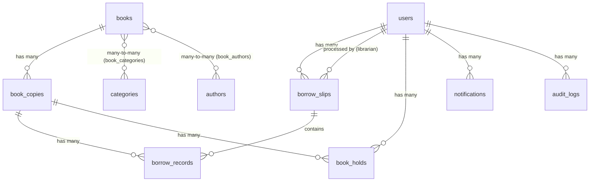

# Database Design

> PostgreSQL database schema cho hệ thống quản lý thư viện.

## ER Diagram (Text)



## Tables

### users
| Column | Type | Constraints | Note |
|--------|------|-------------|------|
| id | BIGSERIAL | PK | |
| username | VARCHAR(50) | UNIQUE, NOT NULL | |
| password_hash | VARCHAR(255) | NOT NULL | BCrypt encoded |
| email | VARCHAR(100) | UNIQUE, NOT NULL | |
| full_name | VARCHAR(100) | NOT NULL | |
| role | VARCHAR(20) | NOT NULL | ADMIN, LIBRARIAN, STUDENT |
| student_id | VARCHAR(20) | UNIQUE, NULLABLE | Mã sinh viên |
| nfc_card_uid | VARCHAR(50) | UNIQUE, NULLABLE | UID thẻ NFC sinh viên |
| is_active | BOOLEAN | DEFAULT true | |
| hold_ban_until | TIMESTAMP | NULLABLE | Tạm khóa đặt mượn đến thời điểm này |
| created_at | TIMESTAMP | DEFAULT NOW() | |

### books
> Đại diện cho một **đầu sách** (metadata). Số lượng bản sao và NFC tag được quản lý qua bảng `book_copies`. Tác giả được chuẩn hóa sang bảng `authors` (V13).

| Column | Type | Constraints | Note |
|--------|------|-------------|------|
| id | BIGSERIAL | PK | |
| title | VARCHAR(255) | NOT NULL | |
| isbn | VARCHAR(20) | UNIQUE, NULLABLE | |
| publisher | VARCHAR(255) | NULLABLE | |
| publish_year | INTEGER | NULLABLE | |
| description | TEXT | NULLABLE | Dùng cho RAG embedding + full-text search |
| cover_image_url | VARCHAR(500) | NULLABLE | |
| created_at | TIMESTAMP | DEFAULT NOW() | |
| updated_at | TIMESTAMP | DEFAULT NOW() | |

### authors *(V13 - New)*
> Đại diện cho một **tác giả**. Một sách có thể có nhiều tác giả (Many-to-Many).

| Column | Type | Constraints | Note |
|--------|------|-------------|------|
| id | BIGSERIAL | PK | |
| name | VARCHAR(255) | NOT NULL | |
| created_at | TIMESTAMP | DEFAULT NOW() | |
| updated_at | TIMESTAMP | DEFAULT NOW() | |

### book_authors (Join table) *(V13 - New)*
| Column | Type | Constraints | Note |
|--------|------|-------------|------|
| book_id | BIGINT | FK → books.id, PK | |
| author_id | BIGINT | FK → authors.id, PK | |

> **Lưu ý**: `quantity` và `available_quantity` đã bị loại bỏ (V9). Giờ tính toán từ `COUNT(book_copies)` — luôn chính xác, không cần đồng bộ.

### book_copies *(V9 - New)*
> Đại diện cho một **cuốn sách vật lý**. Mỗi cuốn có NFC tag riêng và trạng thái riêng.

| Column | Type | Constraints | Note |
|--------|------|-------------|------|
| id | BIGSERIAL | PK | |
| book_id | BIGINT | FK → books.id, NOT NULL | Đầu sách mà cuốn này thuộc về |
| copy_number | INTEGER | NOT NULL | Bản thứ mấy (1, 2, 3...) |
| nfc_tag_uid | VARCHAR(50) | UNIQUE, NULLABLE | UID NFC tag dán trên cuốn sách |
| status | VARCHAR(20) | NOT NULL, DEFAULT 'AVAILABLE' | AVAILABLE, RESERVED, BORROWED, DAMAGED, LOST |
| condition_note | TEXT | NULLABLE | Ghi chú tình trạng cuốn sách |
| created_at | TIMESTAMP | DEFAULT NOW() | |

> UNIQUE constraint: `(book_id, copy_number)` — mỗi đầu sách không có 2 bản trùng số.

### categories
| Column | Type | Constraints | Note |
|--------|------|-------------|------|
| id | BIGSERIAL | PK | |
| name | VARCHAR(100) | UNIQUE, NOT NULL | |
| description | TEXT | NULLABLE | |

### book_categories (Join table)
| Column | Type | Constraints |
|--------|------|-------------|
| book_id | BIGINT | FK → books.id, PK |
| category_id | BIGINT | FK → categories.id, PK |

### borrow_slips *(V9 - New)*
> Đại diện cho một **phiên mượn** (phiếu mượn). Một phiên mượn có thể chứa nhiều cuốn sách, với chung ngày mượn và hạn trả.

| Column | Type | Constraints | Note |
|--------|------|-------------|------|
| id | BIGSERIAL | PK | |
| user_id | BIGINT | FK → users.id, NOT NULL | Người mượn |
| librarian_id | BIGINT | FK → users.id, NULLABLE | Thủ thư xử lý (NULL = dữ liệu cũ) |
| borrow_date | TIMESTAMP | NOT NULL, DEFAULT NOW() | Ngày mượn |
| due_date | TIMESTAMP | NOT NULL | Hạn trả (borrow_date + 14 days, configurable) |
| note | TEXT | NULLABLE | Ghi chú phiếu mượn |
| source | VARCHAR(20) | NOT NULL, DEFAULT 'COUNTER' | COUNTER, NFC |
| created_at | TIMESTAMP | DEFAULT NOW() | |

### borrow_records
> Đại diện cho **một cuốn sách cụ thể** trong phiếu mượn. Mỗi record theo dõi việc mượn/trả một cuốn sách vật lý.

| Column | Type | Constraints | Note |
|--------|------|-------------|------|
| id | BIGSERIAL | PK | |
| copy_id | BIGINT | FK → book_copies.id, NOT NULL | Cuốn sách vật lý đang mượn |
| slip_id | BIGINT | FK → borrow_slips.id, NOT NULL | Phiếu mượn chứa record này |
| return_date | TIMESTAMP | NULLABLE | NULL = chưa trả |
| status | VARCHAR(20) | NOT NULL | BORROWING, RETURNED, OVERDUE |
| note | TEXT | NULLABLE | Ghi chú khi trả sách |
| created_at | TIMESTAMP | DEFAULT NOW() | |

> **Lưu ý V9**: `book_id`, `borrow_date`, `due_date` đã di chuyển — `book_id` → `copy_id` (qua book_copies), `borrow_date`/`due_date` → borrow_slips.
> User được truy xuất qua `borrow_slips.user_id` để đảm bảo chuẩn hóa dữ liệu.

### book_holds *(V11 - New)*
> Đặt mượn (giữ chỗ 24h) cho một cuốn sách vật lý. Hết hạn sẽ tự hủy và mở lại copy.

| Column | Type | Constraints | Note |
|--------|------|-------------|------|
| id | BIGSERIAL | PK | |
| user_id | BIGINT | FK → users.id, NOT NULL | Người đặt mượn |
| copy_id | BIGINT | FK → book_copies.id, NOT NULL | Copy được giữ chỗ |
| status | VARCHAR(20) | NOT NULL | ACTIVE, FULFILLED, CANCELED, EXPIRED |
| reserved_at | TIMESTAMP | NOT NULL | Thời điểm giữ chỗ |
| expires_at | TIMESTAMP | NOT NULL | Hết hạn sau 24h (configurable) |
| fulfilled_at | TIMESTAMP | NULLABLE | Thời điểm xác nhận mượn |
| canceled_at | TIMESTAMP | NULLABLE | Thời điểm hủy / hết hạn |
| cancel_reason | TEXT | NULLABLE | Lý do hủy |
| librarian_id | BIGINT | FK → users.id, NULLABLE | Thủ thư xác nhận/hủy |
| created_at | TIMESTAMP | DEFAULT NOW() | |

### notifications
| Column | Type | Constraints | Note |
|--------|------|-------------|------|
| id | BIGSERIAL | PK | |
| user_id | BIGINT | FK → users.id, NOT NULL | |
| title | VARCHAR(255) | NOT NULL | |
| message | TEXT | NOT NULL | |
| type | VARCHAR(30) | NOT NULL | OVERDUE_WARNING, BORROW_CONFIRM, RETURN_CONFIRM, SYSTEM |
| is_read | BOOLEAN | DEFAULT false | |
| created_at | TIMESTAMP | DEFAULT NOW() | |

### audit_logs
| Column | Type | Constraints | Note |
|--------|------|-------------|------|
| id | BIGSERIAL | PK | |
| user_id | BIGINT | FK → users.id, NULLABLE | NULL = system action |
| action | VARCHAR(50) | NOT NULL | BORROW, RETURN, CREATE_BOOK, DELETE_BOOK, etc. |
| entity_type | VARCHAR(50) | NOT NULL | BOOK, USER, BORROW_RECORD |
| entity_id | BIGINT | NOT NULL | |
| details | TEXT | NULLABLE | JSON string with details |
| ip_address | VARCHAR(45) | NULLABLE | |
| created_at | TIMESTAMP | DEFAULT NOW() | |

## Indexes

```sql
-- Performance indexes (V6)
CREATE INDEX idx_borrow_records_status ON borrow_records(status);
CREATE INDEX idx_notifications_user_id ON notifications(user_id) WHERE is_read = false;
CREATE INDEX idx_books_title ON books(title);
CREATE INDEX idx_audit_logs_created_at ON audit_logs(created_at);
CREATE INDEX idx_users_nfc_card_uid ON users(nfc_card_uid) WHERE nfc_card_uid IS NOT NULL;

-- V9 indexes
CREATE INDEX idx_book_copies_book_status ON book_copies(book_id, status);
CREATE INDEX idx_book_copies_nfc ON book_copies(nfc_tag_uid) WHERE nfc_tag_uid IS NOT NULL;
CREATE INDEX idx_borrow_slips_user_id ON borrow_slips(user_id);
CREATE INDEX idx_borrow_records_copy_id ON borrow_records(copy_id);
CREATE INDEX idx_borrow_records_slip_id ON borrow_records(slip_id);

-- V11 indexes
CREATE INDEX idx_book_holds_user_status ON book_holds(user_id, status);
CREATE INDEX idx_book_holds_copy_id ON book_holds(copy_id);
CREATE INDEX idx_book_holds_expires_active ON book_holds(expires_at) WHERE status = 'ACTIVE';

-- V13 indexes
CREATE INDEX idx_authors_name ON authors(name);
CREATE INDEX idx_book_authors_book ON book_authors(book_id);
CREATE INDEX idx_book_authors_author ON book_authors(author_id);
```

## Flyway Migrations

```
db/migration/
├── V1__create_users_table.sql
├── V2__create_books_and_categories_tables.sql
├── V3__create_borrow_records_table.sql
├── V4__create_notifications_table.sql
├── V5__create_audit_logs_table.sql
├── V6__add_indexes.sql
├── V7__seed_default_data.sql                     # Admin user, sample categories, 5 books
├── V8__add_fulltext_search.sql                   # tsvector + unaccent + GIN index
├── V9__add_book_copies_and_borrow_slips.sql      # book_copies, borrow_slips, refactor borrow_records
├── V10__drop_borrow_records_user_id.sql          # remove denormalized user_id from borrow_records
├── V11__add_book_holds_and_hold_ban.sql          # book_holds + hold_ban_until
├── V12__update_borrow_source_to_counter.sql      # default borrow source to COUNTER
├── V13__add_authors_table.sql                     # authors, book_authors (Many-to-Many authors)
├── V14__add_categories_to_fts.sql                 # category weight C + description weight D in search_vector
└── V15__refresh_fts_on_category_name_update.sql   # refresh book search vectors when category names change
```

## Seed Data (V7)

- 1 Admin user (admin/Admin@123, từ DataInitializer)
- Categories: Công nghệ thông tin, Khoa học, Văn học, Kinh tế, Ngoại ngữ, Lịch sử, Toán học, Vật lý
- 5 sample books (Clean Code, Design Patterns, Intro to Algorithms, Spring in Action, Deep Learning)
- V9 auto-creates book_copies from existing books (N copies per book = quantity)

## Thiết kế quan trọng

### Book vs BookCopy (V9)
```
books (đầu sách — metadata)           book_copies (cuốn sách vật lý)
─────────────────────────              ──────────────────────────────
id: 1                                  id: 1, book_id: 1, copy: 1, nfc: "AA:BB", AVAILABLE
title: "Clean Code"                    id: 2, book_id: 1, copy: 2, nfc: "CC:DD", BORROWED
authors: ["Robert C. Martin"]          id: 3, book_id: 1, copy: 3, nfc: null,    AVAILABLE
```
- `totalCopies` = `COUNT(book_copies WHERE book_id = X)`
- `availableCopies` = `COUNT(book_copies WHERE book_id = X AND status = 'AVAILABLE')`
- Không lưu denormalized → luôn chính xác, code đơn giản

### BorrowSlip vs BorrowRecord (V9)
```
borrow_slips (phiên mượn)              borrow_records (từng cuốn)
─────────────────────                  ──────────────────────────
user_id: 1 (student01)                 copy_id: 2 (Clean Code #2), RETURNED, trả 20/05
borrow_date: 15/05                     copy_id: 5 (Design Patterns #1), BORROWING
due_date: 29/05                        copy_id: 7 (Spring in Action #1), OVERDUE
source: COUNTER
```
- `borrow_date` + `due_date` chung cho cả phiên → trên slip
- `return_date` + `status` riêng từng cuốn → trên record
- Pessimistic lock (`SELECT FOR UPDATE`) khi tìm copy available → chống race condition

## Notes
- Due date mặc định 14 ngày, configurable trong application.yml
- Soft delete có thể cân nhắc cho books và users (thêm `is_deleted` flag)
- Overdue check: `JOIN borrow_slips` để lấy `due_date`, check `< NOW()` với `status = BORROWING`
