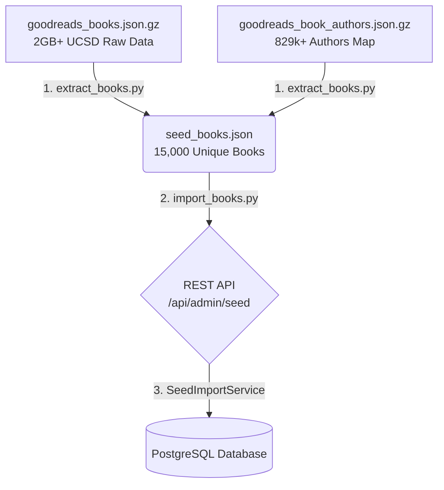

# Kịch bản Dữ liệu (Data Seeding Pipeline) — Awaken Ant Library

Tài liệu này mô tả chi tiết toàn bộ quy trình chuẩn bị dữ liệu sách mẫu (Data Seeding) quy mô lớn từ bộ dữ liệu gốc **Goodreads của UCSD (University of California, San Diego)**.

Quy trình này đã được nâng cấp lên **15.000 cuốn sách độc bản** đi kèm với việc **phân giải danh tính tác giả thực tế** và **chuẩn hóa dữ liệu Nhiều-Nhiều (Many-to-Many)**.

---

## 1. Kiến trúc Pipeline Dữ liệu

Quy trình seed dữ liệu được chia làm 2 giai đoạn độc lập thông qua giao tiếp RESTful API:



---

## 2. Quy trình 1: Cào, Lọc và Giải quyết Tác giả (Data Extraction)

Quy trình này do script `extract_books.py` đảm nhiệm, xử lý trực tiếp tập dữ liệu Goodreads khổng lồ.

### Các kỹ thuật tối ưu hóa chính:
*   **Tải file có khả năng tiếp tục (Resumable Download):** Hỗ trợ header `Range` HTTP để tiếp tục tải file `goodreads_books.json.gz` nếu kết nối bị ngắt quãng giữa chừng.
*   **Streaming Parsing không tốn RAM:** Đọc giải nén trực tiếp bằng thư viện `gzip` và xử lý từng dòng dữ liệu (JSON-Lines format). Tránh nạp toàn bộ file 2GB vào RAM, giữ mức tiêu thụ RAM luôn dưới 50MB.
*   **Dựng bộ nhớ tạm Tác giả siêu tốc:** Stream file `goodreads_book_authors.json.gz` nặng chứa danh mục tác giả, lưu trữ map `author_id -> real_name` trong RAM chỉ mất **2.5 giây** cho hơn 829.000 bản ghi. Điều này giúp giải quyết triệt để vấn đề hiển thị tên tác giả ngẫu nhiên hay chuỗi `Author #ID` vô danh.
*   **Loại bỏ trùng lặp ISBN tại nguồn:** Nhận dạng các phiên bản trùng mã `isbn` (do có nhiều phiên bản tái bản của cùng một cuốn sách) và chỉ giữ lại bản ghi đầu tiên xuất hiện để tuân thủ ràng buộc duy nhất (`UNIQUE`) trong Database.

### Tiêu chí lọc sách chất lượng cao:
*   `description`: Phải dài tối thiểu 100 ký tự (phục vụ hiệu quả cho mô hình RAG / AI Search).
*   `image_url`: Có ảnh bìa hợp lệ (loại bỏ các ảnh có URL dạng placeholder nophoto mặc định của Goodreads).
*   `title` & `authors`: Phải có dữ liệu đầy đủ.
*   `categories`: Tự động phân tích các thẻ phổ biến (`popular_shelves`), loại bỏ thẻ rác (như 'to-read', 'favorites', 'owned'), chuẩn hóa tiêu đề và lấy ra tối đa **2 danh mục chất lượng nhất** (ví dụ: `Science Fiction`, `Business`).

**Đầu ra (Output):** File `seed_books.json` chứa đúng **15.000 cuốn sách độc nhất** kèm thông tin tác giả thực tế, sẵn sàng cho việc nhập liệu.

---

## 3. Quy trình 2: Nhập liệu Hệ thống (Data Import Pipeline)

Quy trình này do script `import_books.py` thực hiện việc đẩy dữ liệu thông qua REST API của Spring Boot.

### A. Cơ chế Giao tiếp REST API
1.  **Xác thực Admin:** Gửi yêu cầu POST tới `/api/auth/login` bằng tài khoản quản trị mặc định:
    *   **Username:** `admin`
    *   **Password:** `Admin@123`
2.  **Lấy JWT Token:** Nhận mã token xác thực từ JSON phản hồi và đính kèm vào header `Authorization: Bearer <token>` cho các yêu cầu tiếp theo.
3.  **Gửi dữ liệu dạng Batch:** Phân cắt file `seed_books.json` thành các lô nhỏ (**Batch Size = 200 cuốn**) để giảm tải cho bộ nhớ đệm Hibernate và tăng tốc độ xử lý mạng. Gửi yêu cầu tới endpoint:
    *   **Endpoint:** `POST /api/admin/seed`
    *   **Payload:** `{ "books": [ ... 200 sách ... ] }`

---

## 4. Xử lý Logic tại Backend (`SeedImportService`)

Khi nhận danh sách sách từ API, `SeedImportService` thực hiện xử lý nghiệp vụ cực kỳ nghiêm ngặt nhằm đồng bộ hóa với lược đồ cơ sở dữ liệu **chuẩn hóa quan hệ Nhiều-Nhiều (V13 Schema)**:

### 1. Phân mảnh Giao dịch (`Propagation.REQUIRES_NEW`)
*   Mỗi cuốn sách được nhập thông qua phương thức `importOne` được chú thích `@Transactional(propagation = Propagation.REQUIRES_NEW)`.
*   **Mục đích:** Nếu một cuốn sách gặp lỗi dữ liệu (ví dụ: lỗi nghiệp vụ đột xuất), transaction của riêng cuốn sách đó sẽ rollback và ghi nhận là `skipped`, hoàn toàn không ảnh hưởng hay làm gián đoạn toàn bộ batch 200 cuốn còn lại.

### 2. Chuẩn hóa Tác giả Nhiều-Nhiều (Many-to-Many Alignment)
*   Do lược đồ V13 đã tách bảng `authors` riêng biệt, hệ thống sẽ thực hiện phân tách chuỗi tác giả bằng dấu phẩy (`split(",")`).
*   Với mỗi tên tác giả đơn lẻ:
    *   Truy vấn bảng `authors` xem đã tồn tại tác giả này chưa.
    *   Nếu chưa có, tự động tạo mới bản ghi `Author` vào bảng `authors`.
    *   Tự động liên kết liên hệ Nhiều-Nhiều vào bảng liên kết trung gian `book_authors` thông qua mối quan hệ `@ManyToMany` JPA.

### 3. Tự động sinh Bản sao vật lý (Book Copies Generation)
*   Để phục vụ cho tính năng mượn/trả sách vật lý thực tế của hệ thống thư viện, mỗi khi tạo thành công một cuốn sách mới, hệ thống tự động sinh ra **3 bản sao vật lý** (`book_copies`):
    *   `copy_number`: Lần lượt đánh số từ 1 đến 3.
    *   `status`: Mặc định đặt là `AVAILABLE` (Sẵn sàng cho mượn).

### 4. Cắt chuỗi an toàn (Safe Data Truncation)
*   Cơ sở dữ liệu giới hạn độ dài `VARCHAR(255)` cho một số trường như `title`, `publisher`. Sách Goodreads có thể chứa tiêu đề phụ rất dài.
*   Hệ thống thực hiện kiểm tra độ dài và tự động cắt chuỗi xuống tối đa **255 ký tự** để ngăn chặn triệt để lỗi SQL `Value too long` (`DataIntegrityViolationException`).

### 5. Xử lý trùng lặp và chuỗi trống ISBN
*   Nếu chuỗi `isbn` gửi lên bị trống hoặc chỉ chứa khoảng trắng, hệ thống tự động chuyển thành `NULL` trước khi lưu (giúp tránh xung đột Unique Constraint vì PostgreSQL cho phép nhiều giá trị `NULL`).
*   Nếu `isbn` hợp lệ đã tồn tại trong database, hệ thống sẽ từ chối ghi đè và ghi nhận `skipped` để giữ nguyên toàn vẹn dữ liệu gốc.

---

## 5. Hướng dẫn chạy thử nghiệm Seeding

1.  **Bước 1: Tạo tệp JSON (Nếu chưa có hoặc muốn tạo lại)**
    ```powershell
    # Kích hoạt môi trường ảo Python
    .\scripts\venv\Scripts\activate
    
    # Chạy trích xuất 15.000 sách sạch
    python .\scripts\extract_books.py
    ```
2.  **Bước 2: Đảm bảo Spring Boot Backend và Database đang chạy**
    ```powershell
    # Khởi động Backend
    mvn spring-boot:run
    ```
3.  **Bước 3: Chạy script Seeding dữ liệu**
    ```powershell
    python .\scripts\import_books.py
    ```
    *Script sẽ tự động đăng nhập, gửi dữ liệu từng batch 200 cuốn và in tiến độ ra console.*

